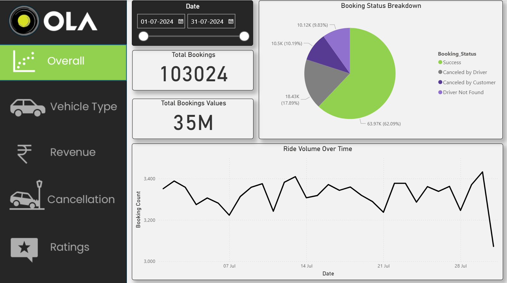
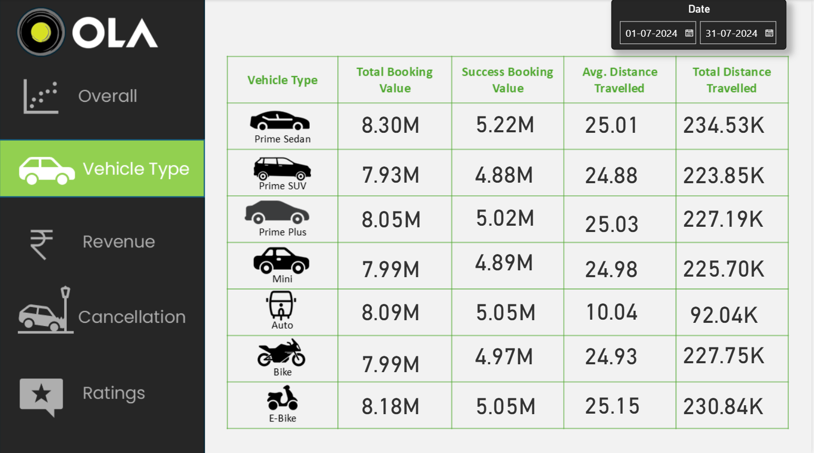
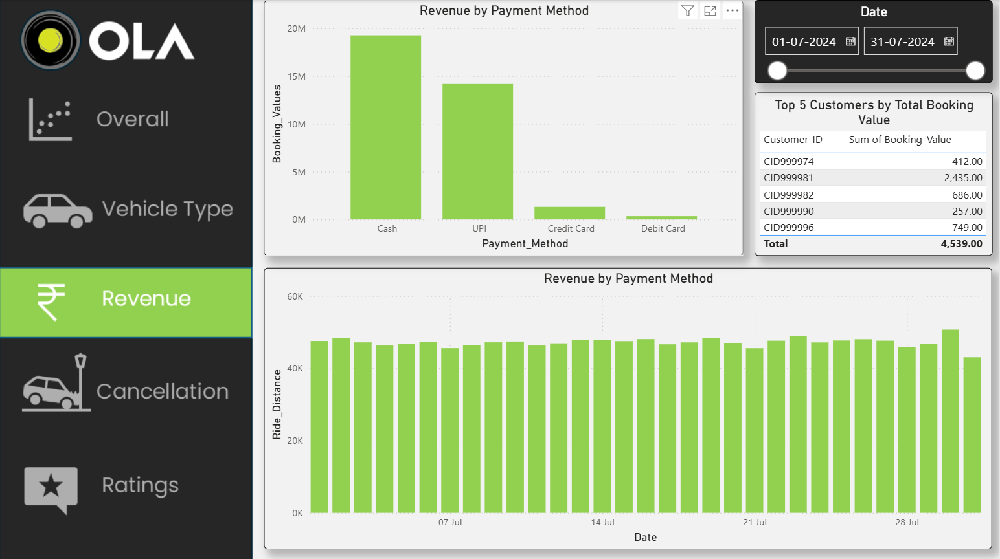
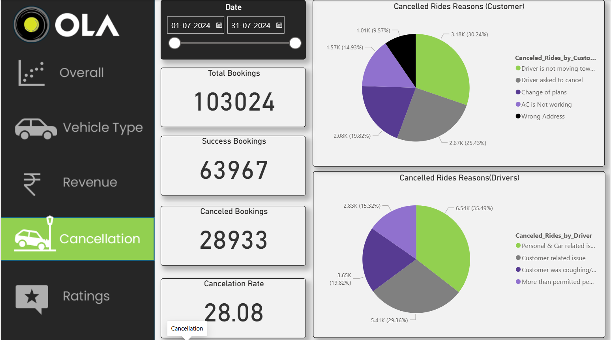
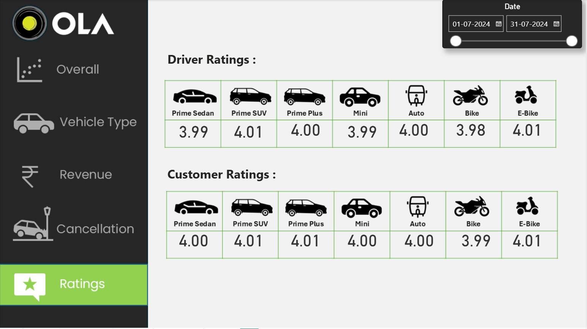

# OLA Ride Booking Analytics Dashboard

## Overview

This project presents a comprehensive Power BI dashboard built using OLA ride booking data to analyze booking performance, revenue generation, cancellation behavior, vehicle utilization, and customer satisfaction.

The dashboard provides business insights that can help improve operational efficiency and customer experience.

---

## Dataset

The dataset contains over 103,000 ride bookings and includes:

- Booking Information
- Ride Status
- Vehicle Type
- Payment Method
- Revenue Data
- Customer Ratings
- Driver Ratings
- Cancellation Reasons

Dataset Source:

[OLA_DataSet.xlsx](./OLA_DataSet.xlsx)

---

## Tools & Technologies

- Power BI Desktop
- Power Query
- DAX
- Data Modeling
- Excel
- Business Intelligence

---

## Dashboard Pages

### 1. Overall Performance

Tracks:

- Total Bookings
- Booking Value
- Successful Bookings
- Booking Status Distribution
- Ride Volume Trend

### 2. Vehicle Type Analysis

Analyzes:

- Booking Value by Vehicle
- Successful Booking Value
- Average Distance Travelled
- Total Distance Travelled

### 3. Revenue Analysis

Tracks:

- Revenue by Payment Method
- Daily Revenue Trends
- Top Customers

### 4. Cancellation Analysis

Customer Cancellation Reasons:

- Driver not moving toward pickup
- Driver asked to cancel
- Change of plans
- AC not working
- Wrong address

Driver Cancellation Reasons:

- Personal/Vehicle issues
- Customer-related issues
- Health concerns
- Excess passenger count

### 5. Ratings Analysis

Compares:

- Customer Ratings
- Driver Ratings
- Vehicle-wise Satisfaction

---

## Key Insights

### Operations

- Total Bookings: 103,024
- Successful Bookings: 63,967
- Cancellation Rate: 28.08%

### Revenue

- Total Booking Value: ₹35 Million
- Cash and UPI generate the majority of revenue.

### Customer Experience

- Driver movement issues are the leading reason for customer cancellations.
- Ratings remain consistently close to 4.0 across all vehicle categories.

### Fleet Performance

- Prime Sedan generates the highest booking value.
- Auto rides have the highest booking frequency despite shorter distances.

---

## Business Recommendations

- Reduce driver-related cancellations through performance monitoring.
- Improve ride matching and pickup efficiency.
- Promote digital payments.
- Implement driver incentive programs.
- Improve vehicle maintenance tracking.

---

## Project Structure

OLA-Ride-Booking-Analytics/

├── Olaride_dashboard.pbix

├── OLA_DataSet.xlsx

├── Images/

│ ├── overall.png

│ ├── vehicle_type.png

│ ├── revenue.png

│ ├── cancellation.png

│ └── ratings.png

├── Ola-Slides.pptx

└── README.md

---

## Dashboard Preview

### Overall Dashboard

### Vehicle Analysis

### Revenue Dashboard

### Cancellation Dashboard

### Ratings Dashboard

---

## Author

Nikhil Pandurang Shinde

B.Tech Electronics and Telecommunication Engineering

Government College of Engineering
